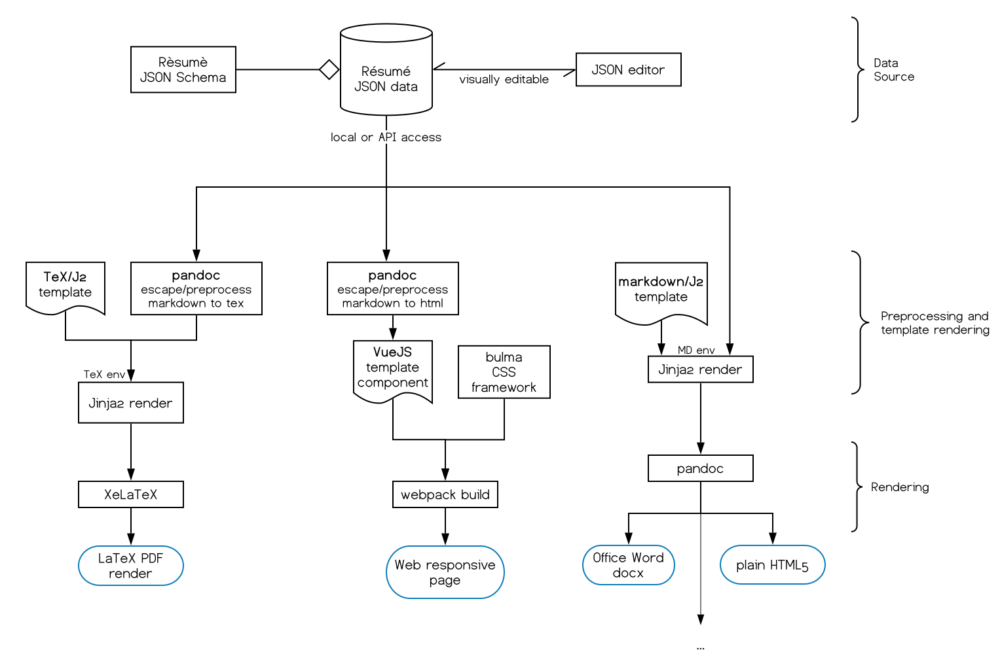
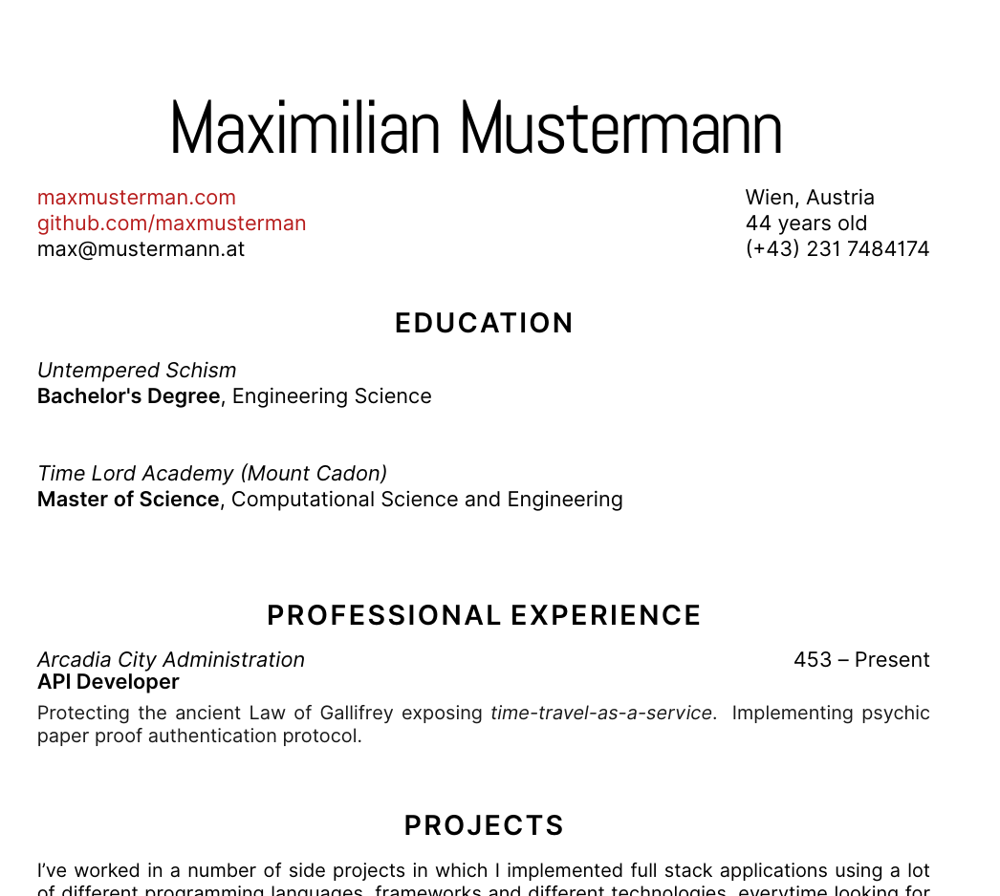

# J2-résumé

> An opinionated workflow to produce different versions of a Curriculum Vitae (résumé) document using different localisations, templates, styles and formats without having to mantain them all.

<br>



## Goals

- Have an agnostic data source (JSON) and edit ONLY that when updating the informations (API access to a remote endpoint exposing a compliant JSON is trivially implementable, too).
- Have data source compliant and validated against a formal specification or schema (use JSON schema and possibly the JSON-Resume specification?). Templates must respect this schema too.
- Easily update and version the data source using a text editor or a (visual) JSON editor;
- Keep the hybrid Jinja2 templates clean and similar to their plain format versions (that's why a LuaLaTeX solution was scraped).

## How it looks like

This is your *JSON data source*:

```json

{
    [...]
    "name": "Maximilian Mustermann",
    "address": "Wien, Austria",
    "age": "44",
    "phone": "(+43) 231 7484174 ",
    "website": "https://maxmusterman.com",
    "github": "https://github.com/maxmusterman",
    "email": "max@mustermann.at",
    [...]
    "education": [
        {
            "title":"Bachelor's Degree",
            "field":"Engineering Science",
            "school":" Technical University of Munich",
        },
        {
            "title":"Master of Science",
            "field":"Computational Science and Engineering",
            "school":"Vienna University of Technology",
        }
    ],
    "work": [
        {
            "position": "API Developer",
            "place": "Time Lord Academy (Mount Cadon)",
            "field": "Untempered Schism",
            "period": "453 -- Present",
            "description": "Protecting the ancient Law of Gallifrey exposing time-travel-as-a-service. Implementing psychic paper proof authentication protocol."
        }
    ]
}
```

### LaTeX

This is how a Jinja2-templated LaTeX document looks like:

```tex
[...]
\begin{document}

\jv{data.name}

\address{ 
\href{\jv{data.website}}{\jv{data.website[8:]}}\\ 
\href{\jv{data.github}}{\jv{data.github[8:]}}\\
\jv{data.email}\\ 
} % Your address 2

\address{
\jv{data.address} \\
\jv{data.age} years old\\
\jv{data.phone}
}

\jb{ for edu in data.education }
    {\sl \jv{edu.school}} \hfill \jv{edu.period} \\ 
    {\sbb \jv{edu.title}}, \jv{edu.field} \\
\jb{ endfor }


\jb{ for experience in data.work }
    {\sl \jv{experience.place} } \hfill \jv{experience.period}\\
    {\sbb \jv{experience.position} } \hfill \jv{experience.field}}\vspace{4pt} \\
    \small{\textcolor{darkgray}{
    \jv{experience.description}
    }
\jb{ endfor }

[...]
```

Basically, a clean TeX file with some Jinja2 syntax inside the `\jb` and `\jv` special tags.

We plug those two and we get a fancy LaTeX render, obtaining:



### React/Vue

Recent tools have native support for plugging JSON data.
E.g. on a Vue component:

```
<title>{{ name }} résumé</title>
Name: {{ name }}
Address: {{ address }}
Age: {{ age }}
Phone: {{ phone }}
Website: {{ website }}
GitHub: {{ github }}
Email: {{ email }} 

<subtitle> Education </subtitle>
<template v-for="degree in education">
    <h3>{{ degree.title }}</h3>
    <subtitle>{{ degree.school }}<br>
    <i>{{ degree.field }}</i></subtitle>
</template>
```

## Build

### Requirements

- a TeX distribution
- XeLaTeX

On Debian:

```bash
sudo apt install texlive-base pandoc python3
```

### LaTeX workflow

```bash
python j2tex.py
xelatex resume.tex
```

## TODO

- [ ] Résumé JSON schema
- [ ] Example Vue template for the web workflow
- [ ] Example MD/HTML5 template for the pandoc workflow
- [ ] pandoc preprocessor to allow Markdown in the field of the json, then preprocess to the target language in each workflow.

## Related projects

If you wish to remain sane, something like [pandoc-resume](https://github.com/mszep/pandoc_resume) could fit your use-case with less effort (BUT it doesn't provide a serialized data source, it's markdown).

## References

Various resources, links and threads examined for the project.

- [How to loop over the JSON object / list?](https://tex.stackexchange.com/questions/489417/how-to-loop-over-the-json-object-list)
- [Error as I try to read and display the results from JSON file](https://tex.stackexchange.com/questions/489395/error-as-i-try-to-read-and-display-the-results-from-json-file/489397#489397)
- [API JSON in Latex](https://tex.stackexchange.com/questions/272401/api-json-in-latex)
- [jq json processor](https://stedolan.github.io/jq/manual/)
- [Transform a JSON file into a formated Latex](https://groups.google.com/forum/#!topic/pandoc-discuss/VBHwMj6IVOY)
- [How to iterate over a comma separated list?](https://tex.stackexchange.com/questions/159118/how-to-iterate-over-a-comma-separated-list)
- [Why choose LuaLaTeX over XeLaTeX?](https://tex.stackexchange.com/questions/126206/why-choose-lualatex-over-xelatex)
- [Considerations when migrating from XeTeX to LuaTeX?](https://tex.stackexchange.com/questions/23598/considerations-when-migrating-from-xetex-to-luatex)
